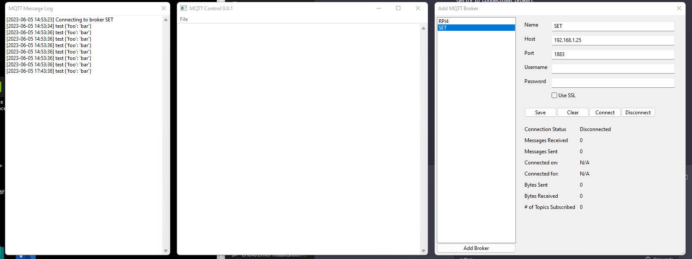

# 2023-06-05.md

- New client is running

- Reads Broker's from settings.json file
- Opens dialogs and places them on the screen
- No saving of which dialogs are open and what their positions are
- Added a BrokerManager that will manage the brokers
    - Uses the ConfigurationManager
- No validation yet
- No tests yet
