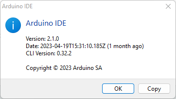
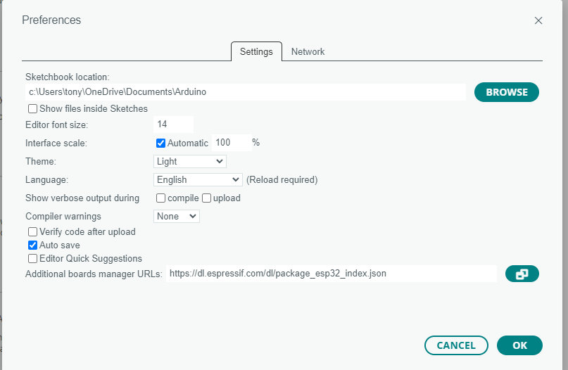
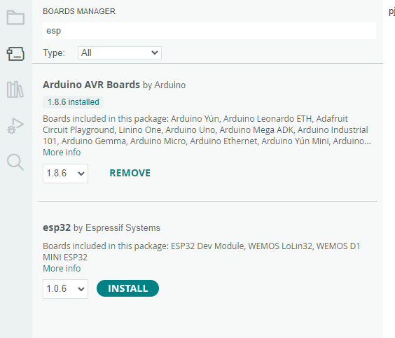
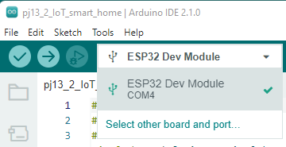

# 2023-06-06.md

## Windows 11

- Installed CH40x on Widnows 11


- [Download and install Arduino IDE](https://support.arduino.cc/hc/en-us/articles/360019833020-Download-and-install-Arduino-IDE)

- arduino-ide_2.1.0_Windows_64bit.exe

- Run Arduino IDE



- Add ESP32 support



- Add this URL
    - https://dl.espressif.com/dl/package_esp32_index.json
    
- Add these two if you want ESP8266 support    
    - https://dl.espressif.com/dl/package_esp32_index.json, http://arduino.esp8266.com/stable/package_esp8266com_index.json

- Open Tools Boards Manager

- Install esp32 by Expressif Systems



- Select ESP32 Dev Module board

- Select Port



- Open Blink example `pj1_1_led.ino`

```cpp
#define led_y 12  //Define the yellow led pin to 12

void setup() {    //The code inside the setup function runs only once
  pinMode(led_y, OUTPUT);  //Set pin to output mode
}

void loop() {     //The code inside the loop function will always run in a loop
  digitalWrite(led_y, HIGH);  //Light up the LED
  delay(200);     //Delay statement, in ms
  digitalWrite(led_y, LOW);   //Close the LED
  delay(200);
}
```

- Compile and upload

```
Sketch uses 198834 bytes (15%) of program storage space. Maximum is 1310720 bytes.
Global variables use 13248 bytes (4%) of dynamic memory, leaving 314432 bytes for local variables. Maximum is 327680 bytes.
esptool.py v3.0-dev
Serial port COM4
Connecting.....
Chip is ESP32-D0WDQ6 (revision 1)
Features: WiFi, BT, Dual Core, 240MHz, VRef calibration in efuse, Coding Scheme None
Crystal is 40MHz
MAC: 40:22:d8:08:28:b8
Uploading stub...
Running stub...
Stub running...
Changing baud rate to 921600
Changed.
Configuring flash size...
Auto-detected Flash size: 4MB
Compressed 8192 bytes to 47...
Writing at 0x0000e000... (100 %)
Wrote 8192 bytes (47 compressed) at 0x0000e000 in 0.0 seconds (effective 32766.5 kbit/s)...
Hash of data verified.
Compressed 18656 bytes to 12053...
Writing at 0x00001000... (100 %)
Wrote 18656 bytes (12053 compressed) at 0x00001000 in 0.1 seconds (effective 995.0 kbit/s)...
Hash of data verified.
Compressed 198944 bytes to 102967...
Writing at 0x00010000... (14 %)
Writing at 0x00014000... (28 %)
Writing at 0x00018000... (42 %)
Writing at 0x0001c000... (57 %)
Writing at 0x00020000... (71 %)
Writing at 0x00024000... (85 %)
Writing at 0x00028000... (100 %)
Wrote 198944 bytes (102967 compressed) at 0x00010000 in 1.8 seconds (effective 880.3 kbit/s)...
Hash of data verified.
Compressed 3072 bytes to 128...
Writing at 0x00008000... (100 %)
Wrote 3072 bytes (128 compressed) at 0x00008000 in 0.0 seconds (effective 6144.1 kbit/s)...
Hash of data verified.

Leaving...
Hard resetting via RTS pin...
```